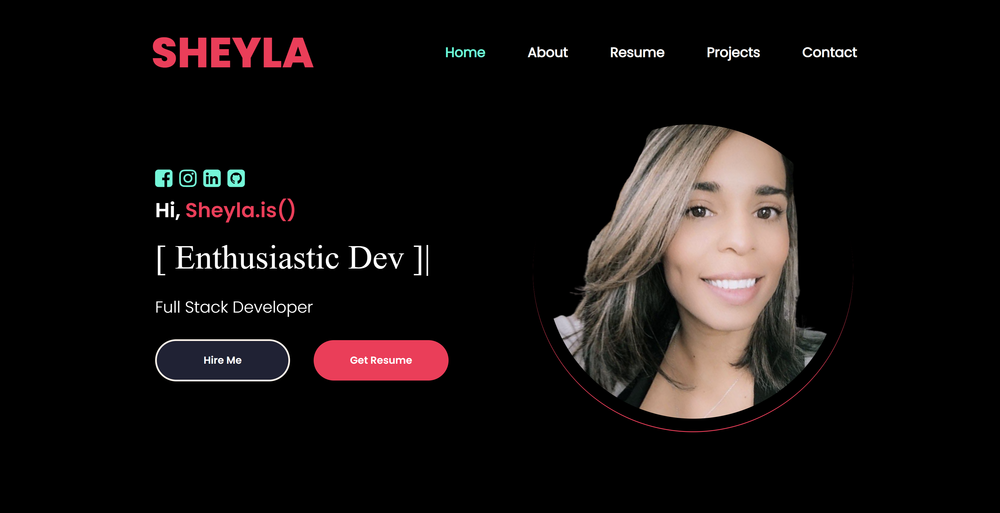

# Professional Portfolio


<p align="center">
 


<p> I am currently in the medical field transitioning into the  exciting world of coding. I have a strong passion for learning and unleashing my creativity in a prosperous way. During your visit if you come across a project or something that has sparked your interest, please feel free to reach out at ✉️ SheylaPopovich@gmail.com or give explore some of my other media pages. I am a firm believer that knowledge is power and sharing that knowledge is incredibly prevailing. Shoot me a message with any inquires you may have or if you would like to collab!</p>
<br>
</br>

💼 Graduate of BootCamp at University Denver - _Full Stack Flex_

🚧 Currently studying "React"

💬 Ask me anything you may be pondering, I'm an open book.

⚡ Fun Facts- Closet nerd I love documentaries and Music fixes everything! 
<br>
<br>
 

# 👀 Sneak Peek
[Sheyla Popovich Portfolio](https://sheyla-michelle-popovich.herokuapp.com/)
<br>
<br>

<br>
<br>
# ☕ Wanna Chat?
Let's chat over Zoom or even meet up for coffee to discuss the endless possibilities!<br>_"Great discoveries and improvements invariably involve the cooperation of many minds."_ <span>-Alexander Graham Bell.</span>
  *  Learn from each other
  *  Share our knowledge
  *  Grow our network
  <br>
<br>

# 🛠️ Built With
My personal portfolio features some of my github projects as well as my resume and technical skills.
This project was built using these technologies.
````
React.js
Node.js
Express.js
BootStrap
Nodemailer
Nodemon
Bootstrap
````
<br>
<br>

# 📑 Features
- Multi-Page Layout
- Styled with React-Bootstrap and Css with easy to customize colors
- Social Media elements
- Implementing SEO
<br>


# 🤝 Show your support
Give a ⭐ if you like this website!
